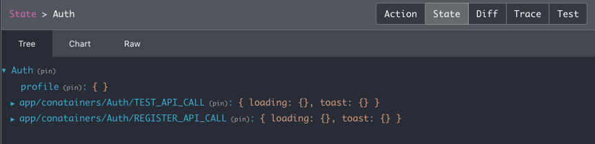
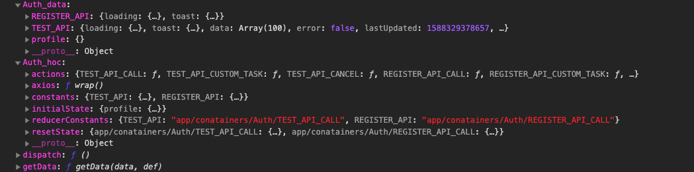
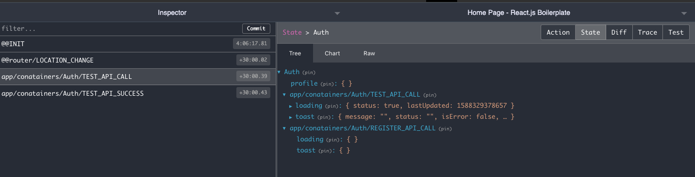
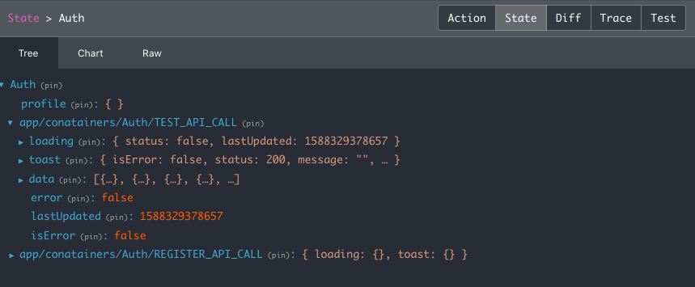

# React Boilerplate Redux Saga HOC

React Boilerplate Redux Saga HOC is a hoc for handling api calls as well as mataintaing redux state.

## # Installation

This package requires **React 16.8.4 or later.**

Use the package manager [npm](https://nodejs.org/en/) to install react-boilerplate-redux-saga-hoc.

```bash
npm i react-boilerplate-redux-saga-hoc
```

or

```bash
yarn add react-boilerplate-redux-saga-hoc
```

## # Setup

[ Beginner Tutorial](https://cartoonmangodev.github.io/react-boilerplate-redux-saga-hoc-docs/docs/getting-started/beginnerTutorial)

#

[Installing on create-react-app scafolding](https://cartoonmangodev.github.io/react-boilerplate-redux-saga-hoc-docs/docs/getting-started/installation-setup#-installing-on-create-react-app-scafolding)

#

[Installing on React-Boilerplate scafolding](https://cartoonmangodev.github.io/react-boilerplate-redux-saga-hoc-docs/docs/getting-started/installation-setup#-installing-on-react-boilerplate-scafolding)

#

[Installing on React-Native](https://cartoonmangodev.github.io/react-boilerplate-redux-saga-hoc-docs/docs/getting-started/installation-setup#-installing-on-react-native)

#

[Installing on Next-js](https://cartoonmangodev.github.io/react-boilerplate-redux-saga-hoc-docs/docs/getting-started/installation-setup#-installing-on-next-js)

> ### **Note:** Before proceeding further.[Please read the detail documentation from here](https://cartoonmangodev.github.io/react-boilerplate-redux-saga-hoc-docs/)

## # Before Start

### 1. Why we created this hoc?

---

    we are repeatedly creating constants, reducer, actions, saga whenever we want to make the API call.
    We are doing the same thing again and again that will make most of the developers feel disconnected from coding.
    To avoid that, we have created a Hoc for you to handle those repeated things.

### 2. Do i need the basic knowledge about redux-saga to use this hoc?

---

    No need to have basic knowledge about redux-saga.
    We are using redux-saga to handle API calls because Redux-Saga is a great library for handling all the side effects.

### 3. Who can use this hoc?

---

    A person who wants to do development faster and also who doesn't want to create constants, reducer, saga, actions repeatedly.

## # Overview

    React Boilerplate Redux-Saga HOC is a Hoc for handling API calls as well as maintain redux state.
    With the help of this Hoc no need to worry about handling multiple API calls.
    Because when you connect this Hoc with the component it will automatically create constants, reducer, saga, actions for you.
    And also provides a method to call the API as well as manipulating the state.

###

    It also handles success, errors, loader, canceling API calls when you are unmounting the component.
    Most of the developers failed to cancel the API calls while unmounting the component.
    That will create unwanted network traffic and also affect the performance of the application.
    No worry Hoc will handle those things.

###

    This package also supports both React and React native.
    So no need to worry about basic configuration and also no separate coding needed.
    Just use the configuration on both react and react-native.

<!-- ## # Contents

---

### **Quickstart**

[# Basic usage](#-basic-usage)

[# Store Configuration](#-store-configuration)

---

### **Before Proceeding Further**

[# Why should i use this package](#-why-should-i-use-this-package)

[# Benefits of using this package](#-benefits-of-using-this-package)

[# Whether this package will support for react-native](#-whether-this-package-will-support-for-react-native)

---

### **How does it works**

[# Step by step process](#-step-by-step-process)

---

### **Storing Data**

[# storing data automatically by calling api](#-storing-data-automatically-by-calling-api)

[# sending query parameters to the api](#-sending-query-parameters-to-the-api)

[# Callbacks for handling success or failure](#-callbacks-for-handling-success-or-failure)

[# Manually storing data by calling custom task](#-manually-storing-data-by-calling-custom-task)

[# Getting Data from store](#getting-data-from-store)

---

### **Updating Data**

[# Updating data automatically by calling api](#-updating-data-automatically-by-calling-api)

[# Updating Data in an Array](#-updating-data-in-an-array)

[# Callbacks for handling Updated Data](#-callbacks-for-handling-updated-data)

[# Manually updating data by calling custom task](#-manually-updating-data-by-calling-custom-task)

[# Getting Updated Data from store](#-getting-updated-data-from-store)

---

### **Handling Infinite Data or Infinite Scrolling**

[# storing infinite data automatically by calling api](#-storing-infinite-data-automatically-by-calling-api)

[# Prepend data instead of appending infinite data](#-prepend-data-instead-of-appending-data)

[# Callbacks for handling infinite success or failure ](#-callbacks-for-handling-success-or-failure-1)

[# Manually storing or updating infinite data by calling custom task](#-manually-storing-or-updating-infinite-data-by-calling-custom-task)

[# Getting Infinite Data from store](#-getting-data-from-store-1)

---

### **Deleting Data**

[# Deleting data by calling api](#-deleting-data-by-calling-api)

[# Deleting key in an object](#-deleting-key-in-an-object)

[# Manually Deleting by calling custom task ](#-manually-deleting-by-calling-custom-task)

[# Getting Data from store](#-getting-data-from-store-2)

---

### **Adding Data based on Filters**

[# Adding filters in api calls](#-adding-filters-in-api-calls)

[# Deleting key in an Filter object](#-deleting-key-in-an-filter-object)

[# Manually Deleting Filter Data by calling custom task ](#-manually-deleting-filter-data-by-calling-custom-task)

[# Getting Filter Data from store ](#-getting-filter-data-from-store)

---

### **Using Subkey for accessing deep object**

[# Adding filters in Deep Object](#-adding-filters-in-deep-object)

[# Deleting key in an deep object](#-deleting-key-in-an-deep-object)

[# Manually Deleting deep object by calling custom task ](#-manually-deleting-subkey-data-by-calling-custom-task)

[# Getting Data from store](#-getting-filter-data-from-store-1)

---

### **Advanced Topics**

[# Creating Custom Reducer](#-creating-custom-reducer)

[# Modifying api end points reducer constants](#-modifying-api-end-points-reducer-constants)

[# Don't reset on setting to initial state ](#-dont-reset-on-setting-to-initial-state)

[# Cancelling Api Calls ](#-cancelling-api-calls)

[# Adding Axios Interceptors ](#-axios-interceptors)

[# Inject saga and reducer to the store ](#-inject-saga-and-reducer-to-the-store)

[# Inject saga and reducer to the store by using hooks ](#-inject-saga-and-reducer-to-the-store-by-using-hooks)

---

### **Util Functions**

[# Safe Function ](#-safe-function)

[# Other Util functions ](#-other-util-functions)

---

### **Others**

[# Params ](#-params)

[# Handling Multiple tasks ](#-handling-multiple-tasks) -->

---

## # Basic usage

### # Store Configuration

    Note:
    - No need to configure store seperately.
    - Store can be imported from react-boilerplate-redux-saga-hoc.

```js
import React from 'react';
import { Provider } from 'react-redux';
import { store as configureStore } from 'react-boilerplate-redux-saga-hoc';

const initialState = {};
const connected_router_enable = false;
const store = configureStore(initialState, connected_router_enable); // by default second parameter will be false
export default function App(props) {
  return (
    <Provider store={store}>
      <CustomComponent />
    </Provider>
  );
}

export default App;
```

### # creating config file

```js
/* config.js */
import { HOC as HocConfigure } from 'react-boilerplate-redux-saga-hoc';

const HOC = HocConfigure({
  handlers: [],
});

const TEST_API =
  'https://jsonplaceholder.typicode.com/posts/'; /* Default method GET */

const REGISTER_API = { url: '/user/register', method: 'POST' };

// const TEST_POSTS_API = {
//   url: "https://jsonplaceholder.typicode.com/posts/",
//   method: "POST",
// };

// const TEST_WITH_CONFIG_API = {
//   url: "https://jsonplaceholder.typicode.com/posts/",
//   method: "GET",
//   responseStatusCode: [900] /* optional */,
//   responseStatusCodeKey: "code" /* optional */,
//   responseDataKey: "data" /* optional */,
//   responseMessageKey: "message" /* optional */,
// };

const AuthHoc = HOC({
  initialState: {
    profile: {},
  },
  useHook: true /* This will avoid unwanted rendering on every state changes */,
  dontReset: {
    TEST_API /* If you pass anything on don't reset it wont reset the paricular state on setting to reset */,
  },
  apiEndPoints: { TEST_API, REGISTER_API },
  constantReducer: ({ type, state, resetState }) => {
    /* For handling custom action */
    if (type === 'logout') return resetState;
    return state;
  },
  name: 'Auth' /* Reducer name */,
});

export { AuthHoc };
```

### # connecting hoc to the component and make the api calls

```js
/* basic-example.js */
import React, { useEffect } from 'react';
import {
  HOC as HocConfigure,
  useQuery,
} from 'react-boilerplate-redux-saga-hoc';
import { compose } from 'redux';
import { AuthHoc } from './config';

function basicExample(props) {
  const {
    Auth_hoc: {
      reducerConstants: { TEST_API },
      reducerName,
      actions: { TEST_API_CALL, TEST_API_CANCEL },
    },
  } = props;

  /* useQuery hook for getting data from the reducer */

  const { loader, data, lastUpdated, isError, error, toast } = useQuery(
    reducerName,
    TEST_API,
  );

  useEffect(() => {
    TEST_API_CALL();
    /* for cancelling api calls on unmounting */
    return () => TEST_API_CANCEL();
  }, []);

  return (
    <ul>
      {data.map(({ title, id }) => (
        <li key={id}>{title}</li>
      ))}
    </ul>
  );
}

export default compose(AuthHoc)(basicExample);
```

1. **This is the image from Redux Store for initial state after connecting hoc to the component**



### **# Things to Remember**

    - The image which we seeing above are the two endpoints which we created before.
    - Hoc will create Constants, Reducer, Saga, Actions for You.
    - No Need worry about creating seperate actions, reducers for every end-points.It will handle by itsself.
    - Just provide the configuration.Hoc will handle all the task for you.

2. **This is the image from Console where hoc will provide actions, constants for handling tasks**



### **# Things to Remember**

    - Hoc will create 3 actions for you for handling api calls,handing data..etc
    - REGISTER_API_CALL: ƒ () - for handling api calls
    - REGISTER_API_CANCEL: ƒ () - for handling api cancel request
    - REGISTER_API_CUSTOM_TASK ƒ () - for handling custom task without doing api calls
    - CALL, CANCEL, CUSTOM_TASK will be created for every api end points

1. **state from Redux Store before api gets success or failure**



### **# Things to Remember**

    - Loader will change to true if api call triggers
    - Toast will reset to initial state

4. **This is state from Redux Store after api gets success**



### **# Things to Remember**

    - Loader will change to false if api call gets success or failure
    - Toast will be stored into to toast key
    - Data will be stored into the data key

### # using useQuery hook in different ways

```js
/* accessing multiple data  at single query */
const {
  test_data: testData,
  test,
  test_deep: testDeep,
  [TEST_API]: testGetApi,
} = useQuery(
  reducerName /* can pass any reducer key such as 'Auth' , 'router' , ..etc*/,
  [
    {
      key: TEST_API,
      name: 'test',
      initialLoaderState: true,
    },
    {
      key: TEST_API,
      name: 'test_deep',
      query: '.data[0]',
      initialLoaderState: false,
    },
    {
      key: TEST_API,
      name: 'test_data',
      query: '.data',
      initialLoaderState: false,
      default: [], // Default for data key it also check's type of data..if type is object return [].Don't pass if you dont want to type check
    },
    TEST_API,
  ],
);

/* query can be used in different ways based on your requirement */

/* pass array of string instead of object */

const {
  [TEST_API]: { loader, data, lastUpdated, isError, error, toast },
} = useQuery(reducerName, [TEST_API]);

/* Pass an object instead of array */
const data = useQuery(reducerName, {
  key: TEST_API,
  query: '.data',
  default: [],
});

/* pass a string insted of array */
const { loader, data, lastUpdated, isError, error, toast } = useQuery(
  reducerName,
  TEST_API,
);

/* Pass a config as a third parameter its optional */
const data = useQuery(reducerName, TEST_API, {
  query: '.data',
  default: [],
});

/* for getting whole reducer data */
const data = useQuery(); // Don't use this use this until its required it will render the component every time reducer change
const data = useQuery(reducerName); // Don't use this until its required it will render the component every time reducer data change
```

#Params

## # task - `<Object>`

|     Props      |              Description               |                                                                                                                                value                                                                                                                                | Default Value  |       type        |                                            usage                                             |
| :------------: | :------------------------------------: | :-----------------------------------------------------------------------------------------------------------------------------------------------------------------------------------------------------------------------------------------------------------------: | :------------: | :---------------: | :------------------------------------------------------------------------------------------: |
|      name      |        Type of task to execute         | `Data-Handler,` <br/> `Infinite-Handler,` <br/>`Delete-Handler,` <br/> `Update-Handler,` <br/> `Update-Key-Handler,` <br/>`Toggle-Key-Handler,` <br/> `Splice-Data-Handler,` <br/> `Delete-Key-Handler,` <br/> `Don't-Update-Data-Handler,` <br/> `Custom-Handler,` | `Data-Handler` |     `string`      |                                  `{ name: 'Data-Handler' }`                                  |
|   clearData    |       clear previous stored data       |                                                                                                                          `true` or `false`                                                                                                                          |    `false`     |     `boolean`     |                                    `{ clearData: true }`                                     |
|     subKey     | for doing various tasks on deep object |                                                                                                                                `[]`                                                                                                                                 |     `null`     |      `array`      |                              `{ subKey: ['data','filter-1'] }`                               |
|     limit      |                                        |                                                                                                                              `number`                                                                                                                               |     `null`     |     `number`      |                          `{ name: 'Infinite-Handler', limit: 15 }`                           |
|  isAppendTop   |                                        |                                                                                                                          `true` or `false`                                                                                                                          |    `false`     |     `boolean`     |                                   `{ isAppendTop: true }`                                    |
|   deleteKey    |                                        |                                                                                                                                `[]`                                                                                                                                 |     `null`     |      `array`      |                               `{ deleteKey: ['age','name'] }`                                |
|       id       |                                        |                                                                                                                                `[]`                                                                                                                                 |     `null`     |      `array`      |                                       `{ id: [1,2] }`                                        |
|      key       |                                        |                                                                                                                              `string`                                                                                                                               |     `null`     |     `string`      |                                       `{ key: 'id' }`                                        |
|   spliceKey    |                                        |                                                                                                                               `[2,4]`                                                                                                                               |     `null`     |      `array`      |                                    `{ spliceKey: [2,4] }`                                    |
|   toggleKey    |                                        |                                                                                                                                `[]`                                                                                                                                 |     `null`     |      `array`      |                               `{ toggleKey: ['age','name'] }`                                |
|     values     |                                        |                                                                                                                             `[] or {}`                                                                                                                              |     `null`     | `array or object` |             `{values: {2: {name: 'ram'}}}` <br/> `{values: [{name: 'sundar'}]}`              |
| updateCallback |                                        |                                                                                                                             `function`                                                                                                                              |     `null`     |    `function`     | `{updateCallback: (previousData,responseData) =>` <br/> `previousData.concat(responseData)}` |

## # request - `<Object>`

|        Props        |   value    |         Default Value         |   type   |                         usage                         |
| :-----------------: | :--------: | :---------------------------: | :------: | :---------------------------------------------------: |
|        query        |    `{}`    |             null              |  object  |                 `{query: { id: 20 }}`                 |
|       params        |    `{}`    |             null              |  object  |                `{params: { id: 20 }}`                 |
|       payload       |    `{}`    |             null              |  object  |                `{payload: { id: 20 }}`                |
|     axiosConfig     |    `{}`    |             null              |  object  |                   `{headers: {} }`                    |
|   paramSerializer   |    `{}`    | `{ arrayFormat: 'brackets' }` |  object  |       `{ arrayFormat: 'comma|bracket|index' }`        |
|    asyncFunction    | `function` |             null              | function |    `{asyncFunction : async (url) => fetch(url)}`}     |
| asyncFunctionParams |  `array`   |             null              |  array   | `{asyncFunctionParams: ['https://www.example.com/']}` |
|        retry        |  `number`  |               0               |  number  |                     `{retry: 3}`                      |
|     errorParser     | `function` |             null              | function |               `{errorParser: () => {}}`               |
|       polling       | `boolean`  |             false             | boolean  |                   `{polling: true}`                   |
|    pollingCount     |  `number`  |           Infinite            |  number  |                  `{pollingCount: 4}`                  |
|        delay        |  `number`  |             8000              |  number  |                   `{delay: 10000}`                    |
|  clearDataOnError   | `boolean`  |             false             | boolean  |              `{clearDataOnError: false}`              |
|  errorDataHandling  | `boolean`  |             true              | boolean  |             `{errorDataHandling: false}`              |
| defaultErrorParser  | `boolean`  |             false             | boolean  |             `{defaultErrorParser: true}`              |

# Before Proceeding Further

We already knows [redux](https://redux.js.org/) is a valuable tool for organising your state and also [redux-saga](https://redux-saga.js.org/) is a powerful middleware for handling side Effects.With the help of those two tools we have created a package for handling api calls and storing data in an organised way.

## # Why should i use this package

    Important:
    -This package is not an alternative for redux and redux-saga
    -This package is mostly for developer who wants to make development faster and also to handle most of the api calls.

## # Benefits of using this package

[Go to Top](#-contents)

    - Handles api calls by itself
    - No need to create store, constants, actions, saga, reducer
    - It handles cancelling api call by itself
    - Handles error, success, cancel, loading, infinite data handling
    - No worry about api calls, loaders...etc
    - No separate coding needed for react and react native

## # Whether this package will support for react-native

#### **Yes** ,this package will support for both [react](https://reactjs.org/) and [react-native](https://reactnative.dev/)

###

> ### **Note:** Please read the detail documentation from [here](https://cartoonmangodev.github.io/react-boilerplate-redux-saga-hoc-docs/)

> ### **Important:** This package now also support nextJS.Please read nextjs setup documentation from [here](https://cartoonmangodev.github.io/react-boilerplate-redux-saga-hoc-docs/docs/getting-started/installation-setup#-installing-on-next-js)

## Contributing

Pull requests are welcome. For major changes, please open an issue first to discuss what you would like to change.

Please make sure to update tests as appropriate.

## License

Copyright (c) 2020-present Chrissie Fernando
